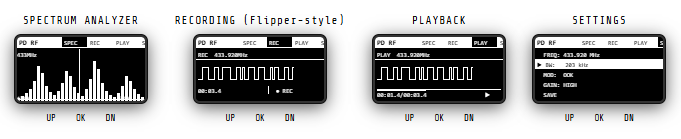

<p align="center">
  
</p>

<h1 align="center">📡 PD nRF24</h1>
<p align="center">
Portable 2.4GHz Wireless Toolkit based on ESP32-C3
</p>

```text
██████╗ ██████╗     ███╗   ██╗██████╗ ███████╗██████╗ ██████╗
██╔══██╗██╔══██╗    ████╗  ██║██╔══██╗██╔════╝╚════██╗██╔══██╗
██████╔╝██║  ██║    ██╔██╗ ██║██████╔╝█████╗   █████╔╝██║  ██║
██╔═══╝ ██║  ██║    ██║╚██╗██║██╔══██╗██╔══╝  ██╔═══╝ ██║  ██║
██║     ██████╔╝    ██║ ╚████║██║  ██║██║     ███████╗██████╔╝
╚═╝     ╚═════╝     ╚═╝  ╚═══╝╚═╝  ╚═╝╚═╝     ╚══════╝╚═════╝
```

## 🌐 Web Flasher 🌐

[🌐 Open Web Flasher](https://agrantx.github.io/PD_nRF24/)

# 🔌 Pinout

### 📡 NRF24L01

| Signal | GPIO    |
| ------ | ------- |
| CE     | GPIO 20 |
| CSN    | GPIO 19 |
| IRQ    | GPIO 18 |
| MOSI   | GPIO 7  |
| MISO   | GPIO 2  |
| SCK    | GPIO 6  |

### 🖥 OLED SSD1306

| Signal | GPIO    |
| ------ | ------- |
| SDA    | GPIO 9  |
| SCL    | GPIO 10 |

### 💾 SD Card

| Signal | GPIO   |
| ------ | ------ |
| CS     | GPIO 8 |
| MOSI   | GPIO 7 |
| MISO   | GPIO 2 |
| SCK    | GPIO 6 |

### 🔘 Buttons

| Button | GPIO    |
| ------ | ------- |
| UP     | GPIO 0  |
| DOWN   | GPIO 1  |
| OK     | GPIO 21 |

# ⚠️ Power Notes

NRF24L01 modules can be sensitive to power quality.

* Use a stable 3.3V supply
* Add a 10µF–100µF capacitor between VCC and GND near the module
* Do not connect VCC to 5V

# 📦 Hardware

* ESP32-C3
* NRF24L01
* OLED SSD1306 (I2C)
* MicroSD Card Module
* 3 Push Buttons

## Upgrading from nRF24L01+ to E01-2G4M27D

This project can be upgraded from a standard nRF24L01+ module to the **E01-2G4M27D** long-range transceiver.

### What needs to be changed?

The SPI connections remain the same:

* VCC → 3.3V
* GND → GND
* CE → CE pin
* CSN → CSN pin
* SCK → SCK pin
* MOSI → MOSI pin
* MISO → MISO pin

### Recommended additions

Because the E01-2G4M27D contains a built-in PA (Power Amplifier) and LNA (Low Noise Amplifier), it requires significantly more current than a standard nRF24L01+.

Recommended:

* Stable 3.3V power supply
* Dedicated voltage regulator for the RF module
* 100µF–470µF capacitor between VCC and GND
* External 2.4GHz SMA antenna (3–5 dBi)
* Short power wires and solid grounding

### Performance Improvements

The E01-2G4M27D is based on the nRF24L01P but includes a built-in PA+LNA stage. It can transmit at up to **27 dBm (500 mW)** and provides much better receiver sensitivity compared to standard nRF24L01+ modules. According to EBYTE specifications, the module supports significantly longer communication distances and improved link stability when used with a proper antenna and power supply.

### Why upgrade?

✔ Higher transmit power

✔ Better reception sensitivity

✔ Improved communication stability

✔ External SMA antenna support

✔ Longer communication range

For projects that require maximum RF performance, the **E01-2G4M27D** is considerably more powerful than a standard nRF24L01+ module and is generally the recommended upgrade option.
